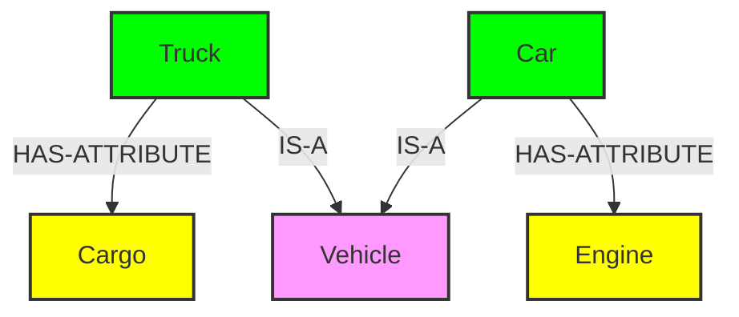
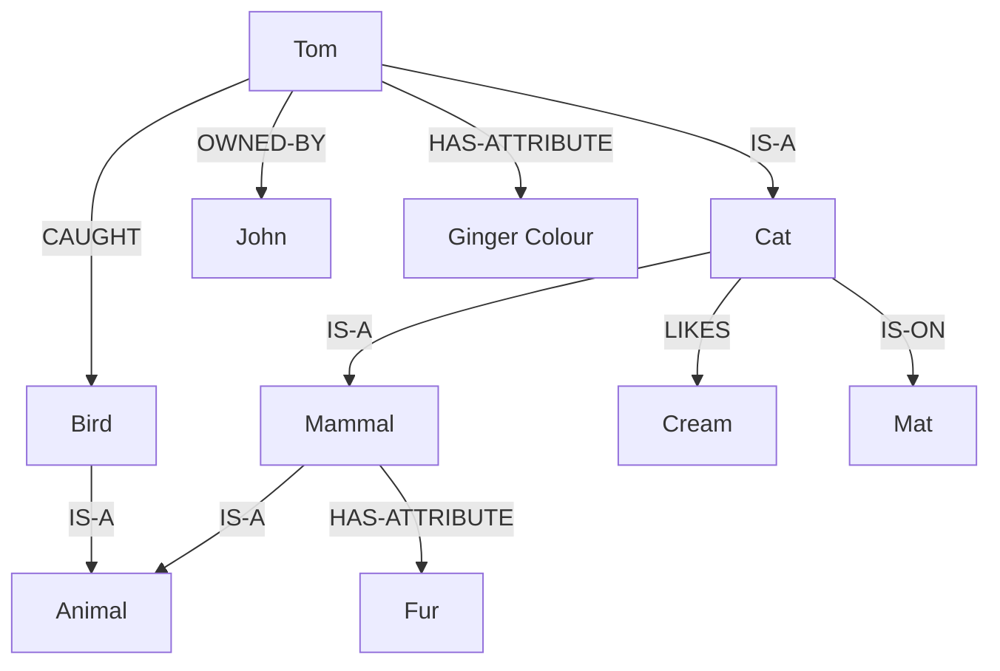
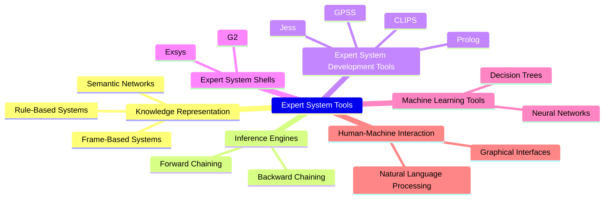
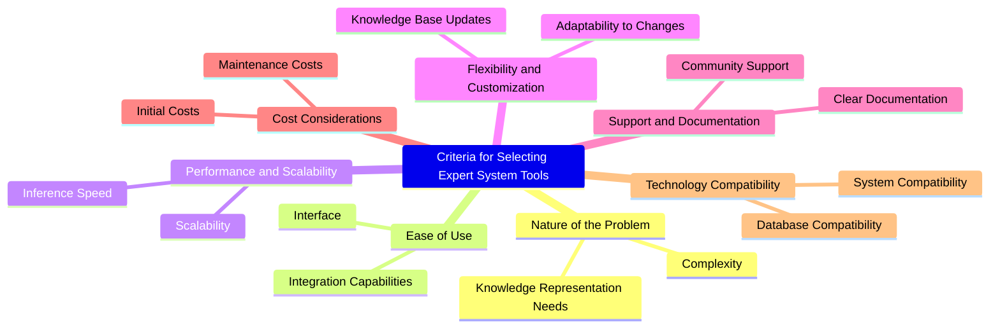

<!--
  Author: omteja04
  Created on: 06-11-2024 19:41:01
  Description: Mid-2
-->

- [1. What is predicate logic? Explain the predicate logic representation with reference to suitable example.](#1-what-is-predicate-logic-explain-the-predicate-logic-representation-with-reference-to-suitable-example)
  - [Key Components of Predicate Logic](#key-components-of-predicate-logic)
  - [Example and Representation in Predicate Logic](#example-and-representation-in-predicate-logic)
  - [Additional Example with Existential Quantifier](#additional-example-with-existential-quantifier)
  - [Importance of Predicate Logic](#importance-of-predicate-logic)
- [Discuss about Knowledge Representation using Semantic Network.](#discuss-about-knowledge-representation-using-semantic-network)
  - [Knowledge Representation using Semantic Networks](#knowledge-representation-using-semantic-networks)
    - [Key Components:](#key-components)
    - [Features:](#features)
    - [Advantages:](#advantages)
    - [Limitations:](#limitations)
    - [Applications:](#applications)
    - [Example Sentences:](#example-sentences)
    - [Semantic Network Representation:](#semantic-network-representation)
    - [Conclusion:](#conclusion)
- [3. Represent the following knowledge using a semantic network.](#3-represent-the-following-knowledge-using-a-semantic-network)
- [4. What is meant by Script? Write a script for Going to Theatre.](#4-what-is-meant-by-script-write-a-script-for-going-to-theatre)
  - [Script Structure](#script-structure)
  - [Components of a Script:](#components-of-a-script)
  - [Example: Going to the Theater Script](#example-going-to-the-theater-script)
  - [Script Invocation:](#script-invocation)
  - [Advantages and Disadvantages of Scripts](#advantages-and-disadvantages-of-scripts)
    - [Advantages:](#advantages-1)
    - [Disadvantages:](#disadvantages)
    - [Solution to Inflexibility:](#solution-to-inflexibility)
- [5. Briefly explain the architecture of expert systems.](#5-briefly-explain-the-architecture-of-expert-systems)
  - [Expert Systems](#expert-systems)
  - [Components of Expert Systems](#components-of-expert-systems)
    - [1. User Interface](#1-user-interface)
    - [2. Inference Engine(Rules of Engine)](#2-inference-enginerules-of-engine)
    - [3. Knowledge Base](#3-knowledge-base)
      - [Components of Knowledge Base](#components-of-knowledge-base)
        - [Factual Knowledge](#factual-knowledge)
        - [Heuristic Knowledge](#heuristic-knowledge)
      - [Knowledge Representation](#knowledge-representation)
      - [Knowledge Acquisitions](#knowledge-acquisitions)
- [6. Give an overview of various types of expert system tools and criteria for selecting the right kind of tool.](#6-give-an-overview-of-various-types-of-expert-system-tools-and-criteria-for-selecting-the-right-kind-of-tool)
  - [Overview of Expert System Tools and Criteria for Selection](#overview-of-expert-system-tools-and-criteria-for-selection)
  - [Criteria for Selecting the Right Expert System Tool](#criteria-for-selecting-the-right-expert-system-tool)

## 1. What is predicate logic? Explain the predicate logic representation with reference to suitable example.

Predicate logic, also known as _first-order logic_, extends propositional logic by incorporating **quantifiers** and **predicates**, which allow for more complex statements about objects, their properties, and relationships. Predicate logic enables us to represent and reason about statements in a structured way by using variables, functions, and relations.

### Key Components of Predicate Logic

1. **Predicates**: Represent properties or relationships among objects. A predicate is often represented by a capital letter, followed by variables in parentheses. For example, \( P(x) \) could denote "x is a person."
2. **Quantifiers**: Express the scope of a variable within a statement.

   - **Universal Quantifier** (\( \forall \)): Denotes "for all." For example, \( \forall x \, P(x) \) means "P(x) is true for all x."
   - **Existential Quantifier** (\( \exists \)): Denotes "there exists." For example, \( \exists x \, P(x) \) means "there exists an x such that P(x) is true."

3. **Variables**: Symbols that represent objects in the domain of discourse, such as \( x \), \( y \), etc.

4. **Logical Connectives**: Such as conjunction (\( \land \)), disjunction (\( \lor \)), implication (\( \rightarrow \)), and negation (\( \neg \)).

5. **Domain of Discourse**: The set of all possible values that a variable may take.

### Example and Representation in Predicate Logic

Consider the statement:

> "All humans are mortal."

To represent this in predicate logic, we can:

- Define a predicate \( H(x) \) to represent "x is a human."
- Define another predicate \( M(x) \) to represent "x is mortal."

The statement can then be represented as:
\[
\forall x \, (H(x) \rightarrow M(x))
\]
This reads as "For all x, if x is a human, then x is mortal."

### Additional Example with Existential Quantifier

Now, consider a slightly different statement:

> "Some humans are doctors."

We can represent this as:

- Define \( D(x) \) to represent "x is a doctor."

The statement in predicate logic would be:
\[
\exists x \, (H(x) \land D(x))
\]
This reads as "There exists an x such that x is a human and x is a doctor."

### Importance of Predicate Logic

Predicate logic is more expressive than propositional logic. It allows us to represent and reason about general rules, relationships, and structures in a domain.

---

## Discuss about Knowledge Representation using Semantic Network.

### Knowledge Representation using Semantic Networks

Semantic networks are a way to represent knowledge through nodes and edges, where **nodes** represent concepts (objects, events, ideas) and **edges** represent relationships between these concepts. This approach is widely used in artificial intelligence (AI) and cognitive science to model human knowledge in a structured and interpretable form.

#### Key Components:

1. **Nodes**: These represent concepts or entities. For example, a node could represent a "Dog," "Car," or "Tree."
2. **Edges**: These represent relationships between the nodes. For instance, a relationship might be "is-a," "part-of," or "has."
   - **is-a**: Denotes categorization (e.g., "Dog is-a Mammal").
   - **part-of**: Denotes part-whole relationships (e.g., "Wheel part-of Car").
   - **has**: Indicates possession or association (e.g., "Car has Engine").
3. **Labels**: Edges are often labeled to specify the relationship, providing meaning to the connection between nodes.

#### Features:

- **Inheritance**: Nodes inherit properties from parent nodes, which simplifies knowledge representation. For example, a "Dog" inherits properties like "Warm-blooded" from "Mammal."
- **Hierarchical Structure**: Semantic networks naturally represent hierarchical knowledge, such as taxonomies or classification systems.

#### Advantages:

1. **Intuitive**: Easy to understand and visualize relationships.
2. **Reasoning**: Inferences can be made based on the network structure (e.g., since "Dog" is a "Mammal," it is warm-blooded).
3. **Extensibility**: New concepts and relationships can be added without disrupting the existing structure.

#### Limitations:

1. **Ambiguity**: Relationships can be vague or multiple, leading to confusion.
2. **Scalability**: As the network grows, it can become complex and harder to manage.
3. **Limited Formality**: Lacks the rigor of more formal systems like logic-based representations.

#### Applications:

- **Natural Language Processing (NLP)**: Used to model word meanings and their relationships.
- **Expert Systems**: Represent domain-specific knowledge for automated decision-making.
- **Knowledge Graphs**: Used by search engines and AI systems to structure data and improve reasoning.

#### Example Sentences:

1. A **Car** _is a_ **Vehicle**.
2. A **Truck** _is a_ **Vehicle**.
3. A **Car** _has a_ **Engine**.
4. A **Truck** _has a_ **Cargo**.

#### Semantic Network Representation:

In this network:

- "Vehicle" is the general concept, and both "Car" and "Truck" are specific types of vehicles.
- "Car" has an "Engine" and "Truck" has "Cargo."

#### Conclusion:

Semantic networks provide a simple and effective way to represent relationships between concepts, making them useful in AI, NLP, and expert systems. However, they face challenges in complexity and scalability when dealing with more intricate knowledge structures.

---

## 3. Represent the following knowledge using a semantic network.

**Tom _is a_ Cat**
**Tom _caught a_ bird**
**Tom _is owned by_ John**
**Tom is ginger _in color_**
**Cats _like_ cream**
**Cat _is on_ the mat**
**A Cat _is a_ Mammal**
**A Bird _is an_ animal**
**_All_ mammals are animals**
**Mammals _have_ fur**

> _Optional_
> A **semantic network** is a graphical representation of knowledge in which **nodes** represent concepts or entities, and **edges** (links) represent the relationships between them. This structure allows complex information to be organized in a way that captures both the **hierarchical** relationships (e.g., "is-a" or "part-of") and **associative** relationships (e.g., "owns" or "likes") between entities.
>
> ### Key Elements of a Semantic Network
>
> 1.  **Nodes**: Represent objects, concepts, or entities (e.g., "Cat," "Tom," "Cream").
> 2.  **Edges**: Represent relationships or connections between nodes (e.g., "is-a," "has-attribute," "likes").
> 3.  **Labels**: Each edge often has a label to define the nature of the relationship, like "IS-A" for category membership, "HAS-ATTRIBUTE" for properties, and "LIKES" for preferences.
>
> ### Features and Uses of Semantic Networks
>
> - **Hierarchical Representation**: Allows for "is-a" and "part-of" relations, which help in organizing knowledge in a taxonomic or categorical hierarchy.
> - **Associative Relationships**: Captures non-hierarchical relationships, enabling a flexible and realistic representation of knowledge.
> - **Inference Capability**: By navigating the network, it's possible to infer new knowledge, such as deducing that "Tom is an animal" if "Tom is a cat" and "a cat is a mammal" and "a mammal is an animal."
>
> ### Applications
>
> Semantic networks are widely used in areas such as **artificial intelligence**, **knowledge representation**, **natural language processing**, and **expert systems** to simulate understanding, organize complex information, and enable machines to reason about relationships between concepts.

---

## 4. What is meant by Script? Write a script for Going to Theatre.

### Script Structure

- **Introduced by Schank and Abelson in 1977** using the Conceptual Dependency (CD) framework.
- Scripts represent stereotyped, predictable situations (e.g., going to a theater, dining at a restaurant).
- **Key Characteristics**:
  - Contain slots with default values and type information, similar to **frames**.
  - Values of slots must be **ordered** and have specialized roles.
  - Event sequences are structured with clausal relationships, ensuring they follow a pattern.
  - Focuses on **stereotypical events** that occur in known patterns.

### Components of a Script:

1. **Entry Conditions**:

   - Conditions that must be true for the script to be activated.
   - Example: Person wants to see a play and has money.

2. **Results**:

   - Outcomes that occur after the events in the script.
   - Example: Person sees the play, has less money, and may be happy.

3. **Props**:

   - Objects involved in the event.
   - Example: Tickets, seats, and the play itself.

4. **Roles**:

   - The people or entities involved in the event.
   - Example: Person (P), Ticket Distributor (TD), and Ticket Checker (TC).

5. **Track**:

   - A specific variation of a more general pattern in the script.
   - Example: "Play in Theater" is one track, while another might be "Buying Snacks at Theater".

6. **Scenes**:
   - Sequence of events that occur in the script.
   - Events are represented using conceptual dependency forms.

### Example: Going to the Theater Script

1. **PTRANS**: Person Transfer
2. **ATTEND**: Attention
3. **MTRANS**: Movement Transfer
4. **MOVES**: Movement
5. **POSS_by**: Possession by

### Script Invocation:

- Activated based on the **significance** of the topic.
- Example:
  - "John enjoyed the play" → "Play in Theater" script invoked to answer related questions.
  - "John went to the theater to pick his daughter" → Less significance, script for "Picking up Daughter" might be invoked instead.

### Advantages and Disadvantages of Scripts

#### Advantages:

- **Prediction of Implicit Events**: Scripts help in predicting events that are not explicitly stated, making it easier to understand situations and draw conclusions based on context.
- **Coherent Interpretation**: They allow a single, coherent interpretation to be built from a collection of observations, making it easier to understand and predict behavior in familiar scenarios.

#### Disadvantages:

- **Inflexibility**: Scripts are more specific and less general than frames, meaning they may not be adaptable to situations that deviate from the predefined pattern or script.
- **Limited Representation**: Not suitable for representing all types of knowledge, especially those that involve dynamic, less predictable events or scenarios.

#### Solution to Inflexibility:

- **Memory Organization Packets (MOPs)**: To address the inflexibility of scripts, smaller, more flexible modules (MOPs) can be combined in ways that are appropriate for specific situations, providing more adaptability.

---

## 5. Briefly explain the architecture of expert systems.

### Expert Systems

The expert systems are the computer applications developed to solve complex problems in a particular domain, at the level of extra-ordinary human intelligence and expertise.

### Components of Expert Systems

An expert system mainly consists of three components:

- User Interface
- Inference Engine
- Knowledge Base

#### 1. User Interface

The **user interface** enables interaction between the expert system and the user by accepting queries in a user-friendly format and passing them to the inference engine. After receiving the response from the inference engine, it presents the output to the user. In essence, it serves as a bridge, allowing non-expert users to communicate with the expert system and obtain solutions.

#### 2. Inference Engine(Rules of Engine)

- The inference engine is known as the brain of the expert system as it is the main processing unit of the system. It applies inference rules to the knowledge base to derive a conclusion or deduce new information. It helps in deriving an error-free solution of queries asked by the user.
- With the help of an inference engine, the system extracts the knowledge from the knowledge base.
- There are two types of inference engine:
  - **Deterministic Inference engine**: The conclusions drawn from this type of inference engine are assumed to be true. It is based on facts and rules.
  - **Probabilistic Inference engine**: This type of inference engine contains uncertainty in conclusions, and based on the probability.

Inference engine uses the below modes to derive the solutions:

**Forward Chaining**: It starts from the known facts and rules, and applies the inference rules to add their conclusion to the known facts.

**Backward Chaining**: It is a backward reasoning method that starts from the goal and works backward to prove the known facts.

#### 3. Knowledge Base

- The knowledge base is a type of storage that stores knowledge acquired from the different experts of the particular domain. It is considered as big storage of knowledge. The more the knowledge base, the more precise will be the Expert System.

- It is similar to a database that contains information and rules of a particular domain or subject.
- One can also view the knowledge base as collections of objects and their attributes. Such as a Lion is an object and its attributes are it is a mammal, it is not a domestic animal, etc.

##### Components of Knowledge Base

###### Factual Knowledge

The knowledge which is based on facts and accepted by knowledge engineers comes under factual knowledge.

###### Heuristic Knowledge

This knowledge is based on practice, the ability to guess, evaluation, and experiences.

##### Knowledge Representation

It is used to formalize the knowledge stored in the knowledge base using the If-else rules.

##### Knowledge Acquisitions

It is the process of extracting, organizing, and structuring the domain knowledge, specifying the rules to acquire the knowledge from various experts, and store that knowledge into the knowledge base.

---

## 6. Give an overview of various types of expert system tools and criteria for selecting the right kind of tool.

### Overview of Expert System Tools and Criteria for Selection

**Expert System Tools:**

1. **Knowledge Representation Tools:**

   - **Rule-Based Systems**: Use "if-then" rules for decision-making, suitable for diagnostics.
   - **Frame-Based Systems**: Represent knowledge with frames containing data and procedures.
   - **Semantic Networks**: Use nodes (concepts) and links (relationships) for structured knowledge.

2. **Inference Engines:**

   - **Forward Chaining**: Starts from facts and applies rules to deduce new information.
   - **Backward Chaining**: Begins with a goal and works backward to find supporting facts.

3. **Expert System Development Tools:**

   - **CLIPS & Jess**: Popular rule-based tools for building expert systems.
   - **Prolog**: Suitable for logic-based systems using symbolic reasoning.
   - **GPSS**: Used for simulation and modeling in expert systems.

4. **Expert System Shells**: Predefined frameworks for building expert systems (e.g., G2, Exsys).

5. **Machine Learning-Based Tools**: Neural networks and decision trees for data-driven decision-making.

6. **Human-Machine Interaction Tools**: Includes graphical interfaces and natural language processing for user interaction.

### Criteria for Selecting the Right Expert System Tool

1. **Nature of the Problem**: Choose tools based on problem complexity (simple vs. complex) and knowledge representation needs (rules, frames).
2. **Ease of Use**: The tool should have an intuitive interface and integration capabilities with existing systems.

3. **Performance and Scalability**: The tool should handle large datasets efficiently and scale as the knowledge base grows.

4. **Flexibility and Customization**: Ensure the tool adapts easily to changes in the problem domain.

5. **Support and Documentation**: Look for strong community support and clear documentation for troubleshooting.

6. **Cost**: Consider both the initial cost and maintenance costs for long-term use.

7. **Technology Compatibility**: Ensure compatibility with existing technologies (e.g., programming languages, databases).

In conclusion, the tool selected should meet the technical, functional, and budgetary needs of the expert system application.

---

 

  

