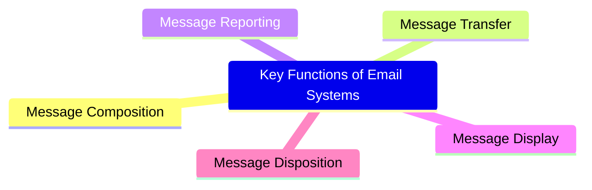

<!--
  Author: omteja04
  Created on: 02-11-2024 20:03:08
  Description: Mid-2

-->

- [Mid 2](#mid-2)
  - [Differentiate the Virtual Circuit and Datagram Networks.](#differentiate-the-virtual-circuit-and-datagram-networks)
  - [Discuss the different Congestion control policies.](#discuss-the-different-congestion-control-policies)
    - [1. Open Loop Congestion Control](#1-open-loop-congestion-control)
    - [2. Closed Loop Congestion Control](#2-closed-loop-congestion-control)
  - [Explain Leaky Bucket and Token Bucket algorithms.](#explain-leaky-bucket-and-token-bucket-algorithms)
    - [1. Leaky Bucket Algorithm](#1-leaky-bucket-algorithm)
      - [How it Works:](#how-it-works)
      - [Characteristics:](#characteristics)
      - [Applications:](#applications)
      - [Example:](#example)
    - [2. Token Bucket Algorithm](#2-token-bucket-algorithm)
      - [How it Works:](#how-it-works-1)
      - [Characteristics:](#characteristics-1)
      - [Applications:](#applications-1)
      - [Example:](#example-1)
    - [Comparison of Leaky Bucket and Token Bucket](#comparison-of-leaky-bucket-and-token-bucket)
    - [Key Takeaways](#key-takeaways)
  - [Explain the Hierarchical Routing algorithm and discuss its advantages and limitations.](#explain-the-hierarchical-routing-algorithm-and-discuss-its-advantages-and-limitations)
    - [How Hierarchical Routing Works](#how-hierarchical-routing-works)
    - [Advantages of Hierarchical Routing](#advantages-of-hierarchical-routing)
    - [Limitations of Hierarchical Routing](#limitations-of-hierarchical-routing)
  - [Explain standard Ethernet (IEEE 802.3)](#explain-standard-ethernet-ieee-8023)
    - [1. Frame Format](#1-frame-format)
      - [Summary of Frame Format](#summary-of-frame-format)
    - [2. Transmission Speed](#2-transmission-speed)
    - [3. Media Access Control (MAC)](#3-media-access-control-mac)
    - [4. Physical Layer Specifications](#4-physical-layer-specifications)
    - [5. Network Topology](#5-network-topology)
    - [6. Full Duplex and Switching](#6-full-duplex-and-switching)
    - [7. IEEE 802.3 Standards Variants](#7-ieee-8023-standards-variants)
    - [Summary](#summary)
  - [Explain TCP Connection management Finite State Machine. Explain all states in it.](#explain-tcp-connection-management-finite-state-machine-explain-all-states-in-it)
    - [TCP Connection Management States](#tcp-connection-management-states)
      - [1. **CLOSED**](#1-closed)
      - [2. **LISTEN**](#2-listen)
      - [3. **SYN-SENT**](#3-syn-sent)
      - [4. **SYN-RCVD**](#4-syn-rcvd)
      - [5. **ESTABLISHED**](#5-established)
      - [6. **FIN-WAIT-1**](#6-fin-wait-1)
      - [7. **FIN-WAIT-2**](#7-fin-wait-2)
      - [8. **TIME-WAIT**](#8-time-wait)
      - [9. **CLOSE-WAIT**](#9-close-wait)
      - [10. **LAST-ACK**](#10-last-ack)
    - [Summary of State Transitions](#summary-of-state-transitions)
    - [Conclusion](#conclusion)
  - [Explain the structure of TCP Header format.](#explain-the-structure-of-tcp-header-format)
    - [TCP Header Format](#tcp-header-format)
    - [Field Descriptions](#field-descriptions)
    - [Conclusion](#conclusion-1)
  - [What are the five basic functions supported in e-mail systems? Explain.](#what-are-the-five-basic-functions-supported-in-e-mail-systems-explain)

# Mid 2

## Differentiate the Virtual Circuit and Datagram Networks.

Virtual circuit and datagram networks are two fundamental approaches to packet-switched networking, and they differ primarily in how they establish connections and handle data transmission.

| Feature | Virtual Circuit Network | Datagram Network |
| ----------------------- | -------------------------------------------------------------------------------------------------------- | ------------------------------------------------------------------------------------------------------- |
| **Connection Type** | Connection-oriented | Connectionless |
| **Setup Phase** | Required (establishes a route) | Not required |
| **Path Consistency** | Fixed path for all packets | Variable paths per packet |
| **Delay** | **Lower delay** after setup, as the path is predefined | **Potentially higher delay** due to route calculation for each packet |
| **Order** | Maintains **packet order**, as all packets follow the same path | **Packets may arrive out of order**, since they may follow different paths |
| **Cost** | Typically **higher setup cost** due to connection establishment and resource reservation | **Lower cost** due to the absence of a connection setup phase |
| **Packet Loss** | **Less prone to packet loss** due to resource reservation and fixed path | **Higher chance of packet loss**, as no resources are reserved |
| **Overhead** | **Higher overhead initially** due to setup requirements; once established, **lower per-packet overhead** | **Lower initial overhead** but **higher per-packet overhead** due to routing information in each packet |
| **Reliability** | More reliable, suitable for applications requiring consistent data delivery | Less reliable, but scalable and suitable for dynamic data traffic |
| **Resource Allocation** | Resources are reserved, which can ensure quality of service (QoS) | No reserved resources; relies on best-effort delivery |
| **Example Protocols** | ATM (Asynchronous Transfer Mode), MPLS, Frame Relay | IP, UDP |

**Summary**:

- **Virtual Circuit Networks** excel in scenarios requiring **low delay** and **ordered delivery** but come at a **higher initial cost and setup overhead**.
- **Datagram Networks** provide a **flexible, low-cost solution** suited for less sensitive applications, with trade-offs in **delay, packet loss, and order**.

---

## Discuss the different Congestion control policies.

- **Congestion** in a network may occur when the load on the network (i.e. the number of packets sent to the network) is greater than the capacity of the network (i.e. the number of packets a network can handle.)

- The causes of congestion in a subnet include:

  - Input traffic rate exceeding the output line capacity.
  - Routers processing tasks (like queuing and updating tables) too slowly.
  - Limited buffer capacity in routers.
  - Slow CPU speed at routers, causing delays in routine tasks.

- Congestion Control refers to techniques and mechanisms that can either prevent congestion, before it happens, or remove congestion, after it has happened.
- Congestion control mechanisms are divided into two categories, one category prevents the congestion from happening and the other category removes congestion after it has taken place.
- These two categories are:
  1. Open loop
  2. Closed loop

### 1. Open Loop Congestion Control

Open loop techniques focus on preventing congestion before it occurs. This is achieved through proactive policies that either the source or destination node manages.

1. **Retransmission Policy**:

   - If a packet is lost or damaged during transmission, the sender retransmits it. However, frequent retransmissions increase network load and can worsen congestion.
   - To optimize, **retransmission timers** are carefully adjusted to balance efficiency and network load, ensuring that packets are only resent when necessary, reducing chances of network congestion.

2. **Window Policy**:

   - The sender's **window size** affects how many packets can be sent before needing an acknowledgment.
   - In **Go-Back-N** protocols, lost packets cause the sender to resend multiple packets even if only one packet was lost. This redundancy can increase congestion.
   - **Selective Repeat** is preferred in open loop control, as it allows resending only specific lost packets, reducing unnecessary traffic.

3. **Discarding Policy**:

   - Routers can reduce congestion by selectively discarding less important packets. For example, if congestion arises during audio or video transmission, routers may drop less critical or lower-priority packets.
   - This allows more vital parts of the message to be transmitted with minimal quality impact, ensuring smoother delivery despite congestion.

4. **Acknowledgment Policy**:

   - Acknowledgments (ACKs) themselves add to network load. Instead of acknowledging each packet, the receiver can wait to acknowledge multiple packets at once, reducing traffic.
   - Alternatively, the receiver may delay acknowledgments and send them when needed or when other packets are due for transmission.

5. **Admission Policy**:
   - **Admission control** assesses new traffic before allowing it onto the network. If the network detects a risk of congestion, it may deny the new connection.
   - This policy is similar to a gatekeeping system, where a network resource check prevents overload by blocking excessive traffic from joining when congestion is imminent.

### 2. Closed Loop Congestion Control

Closed loop techniques respond to congestion once it has occurred, using various feedback mechanisms and adjustments to alleviate it.

1. **Backpressure**:

   - When a node becomes congested, it can temporarily stop accepting new packets from the upstream node, forcing data to "back up" in the network.
   - This feedback loop continues back through the nodes toward the source, alerting it to slow down.
   - **Backpressure** works best in **virtual circuit networks**, where nodes maintain information on connections and can control data flow at each point.

   

   In above diagram the 3rd node is congested and stops receiving packets as a result 2nd node may be get congested due to slowing down of the output data flow. Similarly 1st node may get congested and inform the source to slow down.

2. **Choke Packet Technique**:
   - Here, a router experiencing high traffic sends a **choke packet** to the source, instructing it to reduce its sending rate.
   - This targeted approach directly informs the source without affecting intermediate nodes, making it suitable for both **virtual circuits** and **datagram networks**.

3. **Implicit Signaling**:

   - In implicit signaling, the source detects possible congestion based on network performance, without direct communication from congested nodes.
   - For instance, if acknowledgments are delayed or missing, the source may assume congestion and reduce its transmission rate. This technique provides indirect congestion feedback, which is less immediate but effective.

4. **Explicit Signaling**:
   - Unlike implicit signaling, explicit signaling involves the congested node directly informing the source or destination about congestion within the data packets.
   - **Forward Signaling** warns the destination, allowing it to take measures to prevent further congestion.
   - **Backward Signaling** notifies the source, prompting it to slow down transmission to ease congestion.

---

## Explain Leaky Bucket and Token Bucket algorithms.

The **Leaky Bucket** and **Token Bucket** algorithms are two commonly used techniques for controlling network traffic to manage congestion, maintain data flow, and enforce rate limits.

### 1. Leaky Bucket Algorithm

The **Leaky Bucket** algorithm controls data flow by sending data at a steady, fixed rate, even if data arrives in bursts.

#### How it Works:

- Imagine a bucket with a small hole at the bottom. Water (data packets) is poured into the bucket, and it leaks out at a constant rate from the hole.
- When the bucket is full (the maximum buffer capacity), any additional incoming packets (water) will overflow and are discarded (dropped).
- The rate at which data leaves the bucket is constant, regardless of the incoming traffic rate.

#### Characteristics:

- **Constant Output Rate**: Data is sent out at a steady, predictable rate.
- **Smooths Traffic Bursts**: By controlling the outflow, it prevents bursty traffic from overwhelming the network.
- **Packet Loss on Overflow**: When the bucket (buffer) is full, excess packets are dropped, which could lead to data loss.

#### Applications:

- The Leaky Bucket algorithm is commonly used in applications where a steady flow of data is required, such as in **telecommunication networks** to ensure Quality of Service (QoS).
- It's also used in scenarios where preventing sudden traffic bursts is critical to avoid congestion.

#### Example:

If a network device has a bucket with a capacity of 10 packets and a constant leak rate of 1 packet per second, even if packets arrive at a bursty rate, they will only be forwarded at 1 packet per second, maintaining a constant data flow.

### 2. Token Bucket Algorithm

The **Token Bucket** algorithm is more flexible than the Leaky Bucket allows data to be sent in bursts, as long as there are enough tokens available. Tokens are added to the _bucket_ at a steady rate, and each packet of data uses one token.
.png>)

#### How it Works:

- Tokens (representing permission to send packets) are added to a _bucket_ at a constant rate, up to a maximum bucket capacity.
- Each packet sent requires a token. If a token is available, it’s consumed, and the packet is sent.
- If no tokens are available, the packet is either queued until tokens are available or discarded if the bucket remains empty for too long.
- The token bucket allows short bursts of data to be sent as long as there are enough tokens in the bucket.

#### Characteristics:

- **Supports Bursts**: Unlike the Leaky Bucket, the Token Bucket can send packets in bursts if enough tokens are accumulated.
- **Flexible Rate Control**: It enforces an average rate limit while allowing for bursts of traffic, making it ideal for bursty data applications.
- **Tokens are Replenished**: Tokens are added at a regular rate, allowing for controlled burstiness within set limits.

#### Applications:

- The Token Bucket algorithm is often used in **network protocols** like **ATM (Asynchronous Transfer Mode)** and **Ethernet**, where some burstiness is allowed but still requires control.
- It’s also used in **QoS frameworks** where flexibility in data rate control is necessary.

#### Example:

If a network device has a token bucket with a capacity of 10 tokens, and tokens are added at 1 token per second:

- The device can send bursts of up to 10 packets instantly if tokens are available.
- Once the burst is used, it returns to sending 1 packet per second, matching the token replenishment rate.

> optional

### Comparison of Leaky Bucket and Token Bucket

| Feature             | Leaky Bucket                              | Token Bucket                                               |
| ------------------- | ----------------------------------------- | ---------------------------------------------------------- |
| **Traffic Rate**    | Constant, smooth rate                     | Allows bursty traffic with an average rate                 |
| **Handling Bursts** | Not allowed; excess packets are discarded | Burst allowed if tokens are available                      |
| **Main Use Case**   | Applications needing steady data flow     | Applications needing flexibility with bursts               |
| **Packet Loss**     | Discards packets if bucket is full        | Only discards if no tokens are available and queue is full |

### Key Takeaways

- **Leaky Bucket** is strict, maintaining a constant flow rate and discarding excess data.
- **Token Bucket** offers more flexibility, allowing for short bursts while enforcing an average rate, making it more suitable for applications where bursty traffic is acceptable.

---

## Explain the Hierarchical Routing algorithm and discuss its advantages and limitations.

The **Hierarchical Routing Algorithm** is a network routing strategy that organizes routers and networks into layers or levels, creating a hierarchy. Instead of each router in a large network maintaining a full routing table for the entire network, it maintains detailed information about its own local region and less detailed information about other regions. This is common in large-scale networks, like the Internet, where dividing the network into areas (such as regions or domains) makes routing more efficient.

### How Hierarchical Routing Works

1. **Network Division**: The network is divided into multiple regions or areas.
2. **Local Routing Tables**: Each router in a region maintains a detailed routing table for nodes within its own region.
3. **Inter-region Routing**: Routers maintain a summarized or less detailed view of routes in other regions.
4. **Routing Across Regions**: For traffic between different regions, a router forwards packets to a regional gateway router, which then routes the packets based on higher-level routing tables.

For example, in a three-level hierarchy:

- **Level 1**: Routers handle local routing within a small group.
- **Level 2**: A higher-level router aggregates multiple Level 1 regions.
- **Level 3**: An even higher level could aggregate multiple Level 2 regions, handling long-distance traffic between regions.

### Advantages of Hierarchical Routing

1. **Scalability**: Hierarchical routing scales well in large networks by limiting the size of each router’s routing table and reducing the need for global updates across the entire network.
2. **Reduced Overhead**: By only needing detailed information for local regions, routers reduce memory and processing overhead.
3. **Improved Efficiency**: Packets traverse through hierarchical levels, allowing for efficient long-distance routing without needing every router to have a complete view of the network.
4. **Simplified Management**: Managing and troubleshooting network issues becomes easier, as the network is segmented into logical regions or areas.

### Limitations of Hierarchical Routing

1. **Suboptimal Paths**: Routing within a hierarchical structure can sometimes lead to less direct or suboptimal routes, as packets might need to go through designated gateways.
2. **Complexity in Setup**: Creating and maintaining a hierarchical structure can be complex, particularly as the network grows and regions change.
3. **Potential Bottlenecks**: If a higher-level router (gateway) in the hierarchy becomes congested or fails, it can impact traffic between entire regions, leading to network bottlenecks.
4. **Initial Cost**: Implementing a hierarchical routing system may require additional infrastructure and administrative setup, especially in very large networks.

---

## Explain standard Ethernet (IEEE 802.3)

Standard Ethernet, defined by the IEEE 802.3 specification, is a widely adopted technology for local area networks (LANs). It specifies the physical and data link layers of the OSI model, enabling devices on a network to communicate over shared media. Key aspects of IEEE 802.3 Ethernet include:

### 1. Frame Format

- Ethernet transmits data in packets known as frames, which contain fields like:

  1. **Preamble (7 bytes)**: A sequence of alternating 1s and 0s (typically 56 bits) used for synchronization to allow the receiver to lock onto the incoming signal.

  2. **Start of Frame (SOF) (1 byte)**: A specific bit pattern (usually `10101011`) that signifies the start of the actual frame data. It follows the preamble and indicates to the receiving device that a frame is about to begin.

  3. **Destination MAC Address (6 bytes)**: The hardware address of the receiving device.

  4. **Source MAC Address (6 bytes)**: The hardware address of the sending device.

  5. **Type/Length Field (2 bytes)**: Indicates the type of the payload (e.g., IPv4, IPv6) or the length of the data in the frame.

  6. **Data Payload (46 to 1500 bytes)**: The actual data being transmitted, with a minimum length of 46 bytes and a maximum length of 1500 bytes. If the data is less than 46 bytes, padding is added.

  7. **Frame Check Sequence (FCS) (4 bytes)**: A cyclic redundancy check (CRC) value for error checking. It allows the receiving device to verify the integrity of the received frame.

#### Summary of Frame Format

| Field                      | Length           | Description                                     |
| -------------------------- | ---------------- | ----------------------------------------------- |
| Preamble                   | 7 bytes          | Synchronization bits                            |
| Start of Frame (SOF)       | 1 byte           | Indicates the start of the frame                |
| Destination MAC Address    | 6 bytes          | Address of the receiving device                 |
| Source MAC Address         | 6 bytes          | Address of the sending device                   |
| Type/Length Field          | 2 bytes          | Indicates the type of payload or length of data |
| Data Payload               | 46 to 1500 bytes | Actual data being transmitted                   |
| Frame Check Sequence (FCS) | 4 bytes          | Error checking code                             |

### 2. Transmission Speed

- Standard Ethernet (IEEE 802.3) has evolved to support various speeds:
  - **10 Mbps** (original Ethernet)
  - **100 Mbps** (Fast Ethernet, IEEE 802.3u)
  - **1 Gbps** (Gigabit Ethernet, IEEE 802.3ab for copper, IEEE 802.3z for fiber)
  - **10 Gbps and beyond** (IEEE 802.3ae and successive standards)

### 3. Media Access Control (MAC)

- Ethernet uses **Carrier Sense Multiple Access with Collision Detection (CSMA/CD)** to manage access to the shared media:

  - **Carrier Sense (CS)**: A device listens to the network to detect if it's free to send data.
  - **Multiple Access (MA)**: Multiple devices can use the network simultaneously.
  - **Collision Detection (CD)**: If two devices send data simultaneously, a collision occurs, and both devices stop, wait for a random backoff time, and retry.

- CSMA/CD is essential in half-duplex Ethernet. In modern full-duplex Ethernet, collision detection is unnecessary as devices have dedicated communication paths.

### 4. Physical Layer Specifications

- Ethernet can operate over different types of cables, including:
  - **Twisted Pair (Cat5, Cat6)** for Fast and Gigabit Ethernet.
  - **Fiber Optic Cables** for longer-distance and high-speed (Gigabit and beyond) transmissions.
  - **Coaxial Cable** (historical use in early Ethernet networks).

### 5. Network Topology

- Ethernet typically uses **star topology** with a switch at the center, though **bus topology** was used in early Ethernet (10BASE5 and 10BASE2) with coaxial cable.
- Switches help to manage network traffic efficiently, reducing collisions in modern Ethernet networks.

### 6. Full Duplex and Switching

- Full-duplex Ethernet, enabled by modern switches, allows simultaneous sending and receiving of data, effectively doubling the network capacity and eliminating collisions.
- Switches improve network performance by forwarding frames only to the intended recipient.

### 7. IEEE 802.3 Standards Variants

- Over time, IEEE 802.3 has expanded to include various specifications for different speeds and media, like:
  - **802.3u** (100BASE-T for Fast Ethernet)
  - **802.3ab** (1000BASE-T for Gigabit Ethernet on twisted pair)
  - **802.3ae** (10GBASE for 10 Gigabit Ethernet)
  - **802.3by** (25GBASE-T for 25 Gigabit Ethernet)
  - **802.3bs** (400 Gigabit Ethernet for large-scale, high-speed data centers)

### Summary

Standard Ethernet (IEEE 802.3) is a reliable, scalable networking technology used in various environments, from small office networks to large-scale data centers, thanks to its adaptable speeds, topologies, and cabling options.

---

## Explain TCP Connection management Finite State Machine. Explain all states in it.

<!--  -->

TCP (Transmission Control Protocol) connection management is governed by a finite state machine (FSM) that defines the various states a TCP connection can be in and the transitions between these states. The FSM ensures reliable data transmission and orderly connection establishment and termination.

### TCP Connection Management States

The TCP connection management FSM has several states, primarily focused on connection establishment and termination. Here are the key states and their functions:

#### 1. **CLOSED**

- **Description**: The default state when no connection exists.
- **Transitions**:
  - **To LISTEN**: A server process can enter this state to wait for incoming connections (using `listen()`).
  - **To SYN-SENT**: A client can initiate a connection by sending a SYN packet.

#### 2. **LISTEN**

- **Description**: The server is waiting for a connection request from a client.
- **Transitions**:
  - **To SYN-RCVD**: When a SYN packet is received from a client, the server responds with a SYN-ACK.

#### 3. **SYN-SENT**

- **Description**: The client has sent a SYN packet and is waiting for a matching SYN-ACK from the server.
- **Transitions**:
  - **To ESTABLISHED**: If the SYN-ACK is received, the client sends an ACK to complete the handshake.
  - **To CLOSED**: If the SYN-ACK is not received within a timeout period, the client can retransmit the SYN or close the connection.

#### 4. **SYN-RCVD**

- **Description**: The server has received a SYN packet and sent back a SYN-ACK, waiting for the final ACK from the client.
- **Transitions**:
  - **To ESTABLISHED**: If the ACK is received from the client, the connection is established.
  - **To CLOSED**: If no ACK is received after a timeout, the server can go back to the CLOSED state.

#### 5. **ESTABLISHED**

- **Description**: The connection is fully established, and data can be sent in both directions.
- **Transitions**:
  - **To FIN-WAIT-1**: If either side wants to terminate the connection, it sends a FIN packet.

#### 6. **FIN-WAIT-1**

- **Description**: The endpoint has sent a FIN packet and is waiting for an ACK from the other side.
- **Transitions**:
  - **To FIN-WAIT-2**: If the ACK for the FIN is received, the endpoint waits for a FIN from the other side.
  - **To CLOSED**: If a RST (reset) packet is received, the connection is terminated immediately.

#### 7. **FIN-WAIT-2**

- **Description**: The endpoint has received an ACK for its FIN and is waiting for a FIN from the other side.
- **Transitions**:
  - **To TIME-WAIT**: If a FIN packet is received from the other side, the endpoint responds with an ACK and enters the TIME-WAIT state.

#### 8. **TIME-WAIT**

- **Description**: This state ensures that the connection is fully terminated and allows for any delayed packets to be properly handled.
- **Duration**: Typically lasts for twice the maximum segment lifetime (MSL) to ensure that any duplicate packets are not mistakenly considered part of a new connection.
- **Transitions**:
  - **To CLOSED**: After the timer expires, the state transitions to CLOSED, completing the connection termination process.

#### 9. **CLOSE-WAIT**

- **Description**: The endpoint has received a FIN from the other side and is waiting for the application to close the connection.
- **Transitions**:
  - **To LAST-ACK**: When the application closes the connection, the endpoint sends a FIN.

#### 10. **LAST-ACK**

- **Description**: The endpoint is waiting for an ACK after sending a FIN packet.
- **Transitions**:
  - **To CLOSED**: If the ACK for the FIN is received, the connection is fully closed.

### Summary of State Transitions

Here's a simplified view of the transitions between these states:

- **CLOSED** ↔ **LISTEN**: Server ready to accept connections.
- **SYN-SENT** ↔ **SYN-RCVD**: Connection initiation between client and server.
- **ESTABLISHED**: Active data transfer.
- **FIN-WAIT-1** → **FIN-WAIT-2** → **TIME-WAIT** → **CLOSED**: Connection termination process.

### Conclusion

The TCP connection management FSM provides a robust framework for establishing, maintaining, and terminating connections, ensuring reliable data transmission and orderly state transitions. Understanding these states and transitions is crucial for developers and network engineers working with TCP/IP networks.

---

## Explain the structure of TCP Header format.

The TCP (Transmission Control Protocol) header is a crucial part of TCP communications, containing important information required for the reliable transmission of data over networks. Here’s a detailed explanation of the structure of the TCP header format.

### TCP Header Format

The TCP header consists of a fixed-length part (20 bytes) and an optional variable-length part (TCP options), making the total size of the TCP header between 20 bytes (no options) and 60 bytes (with options).

### Field Descriptions

1. **Source Port**: This field specifies the port number of the sending application. It allows the receiving application to know which application to send data to.

2. **Destination Port**: This field specifies the port number of the receiving application, similar to the source port.

3. **Sequence Number**: This is crucial for tracking the order of segments. It identifies the position of the first byte of data in the segment. If the SYN flag is set, this field contains the initial sequence number.

4. **Acknowledgment Number**: This field is used to acknowledge receipt of data. It indicates the next sequence number the sender of the segment is expecting to receive.

5. **HLEN (Header Length)**: This field indicates the size of the TCP header in 32-bit words. It tells the receiving side where the data starts in the segment.

6. **Reserved**: This field is reserved for future use and should be set to zero.

7. **Flags (Control Bits)**: These flags control the state and behavior of the TCP connection. They help manage the connection establishment, maintenance, and termination processes.
   - **URG**: Urgent pointer field significant
   - **ACK**: Acknowledgment field significant
   - **PSH**: Push Function
   - **RST**: Reset the connection
   - **SYN**: Synchronize sequence numbers (used in connection establishment)
   - **FIN**: No more data from the sender (used for connection termination) |
8. **Window Size**: This field indicates the size of the sender's receive window, providing flow control by allowing the sender to know how much data can be sent before waiting for an acknowledgment.

9. **Checksum**: A crucial field for ensuring data integrity, the checksum covers the entire TCP segment (header and data) to detect errors that may have occurred during transmission.

10. **Urgent Pointer**: Used if the URG flag is set; it points to the sequence number indicating the end of urgent data within the segment.

11. **Options**: The options field can include various optional parameters that enhance TCP's functionality, such as maximum segment size or timestamp.

12. **Padding**: This ensures the TCP header aligns to a 32-bit boundary, which is required for processing efficiency.

### Conclusion

The TCP header format is designed to provide the necessary control and information for reliable data transmission. Understanding this structure is fundamental for anyone working with networking protocols, as it underpins how TCP facilitates reliable, ordered communication across IP networks.

---

## What are the five basic functions supported in e-mail systems? Explain.

Email systems support several key functions that facilitate the effective sending, receiving, and
management of electronic messages. Here are the five basic functions:

1. **Message Composition**

   - Users create and prepare messages by typing content, adding recipients’ email addresses, setting a subject line, and attaching files. Many email clients provide rich text formatting options, signatures, and templates to streamline this process. Security measures like encryption and digital signatures can also be employed for safe communication.

2. **Message Transfer**

   - Once a message is composed, it is sent to the recipient's server using the Simple Mail Transfer Protocol (SMTP). SMTP handles the outgoing mail process, managing message queues, ensuring reliable delivery, and retrying in case of temporary failures. It confirms successful transfers, ensuring that the email reaches its destination.

3. **Message Reporting**

   - Reporting provides feedback on the status of sent messages. Users may receive delivery confirmations for successfully delivered emails or bounce-back messages if delivery fails (e.g., due to an incorrect address). Some systems offer read receipts to inform senders when their messages are opened, helping users track communication success.

4. **Message Display**

   - Upon reaching the recipient’s server, the email client displays messages in an organized manner. Emails are categorized into folders (Inbox, Sent, Spam) and equipped with tools for reading, replying, and organizing. Advanced features such as threading and search functions help users efficiently manage and retrieve conversations, while spam filters enhance usability by prioritizing relevant emails.

5. **Message Disposition**
   - This function focuses on the long-term management of emails. Users can store, forward, delete, archive, or categorize messages for better organization. Features such as folders, filters, and labels help automate organization, while some systems offer auto-deletion options for spam or old emails to optimize storage and maintain a manageable inbox.

 

  

