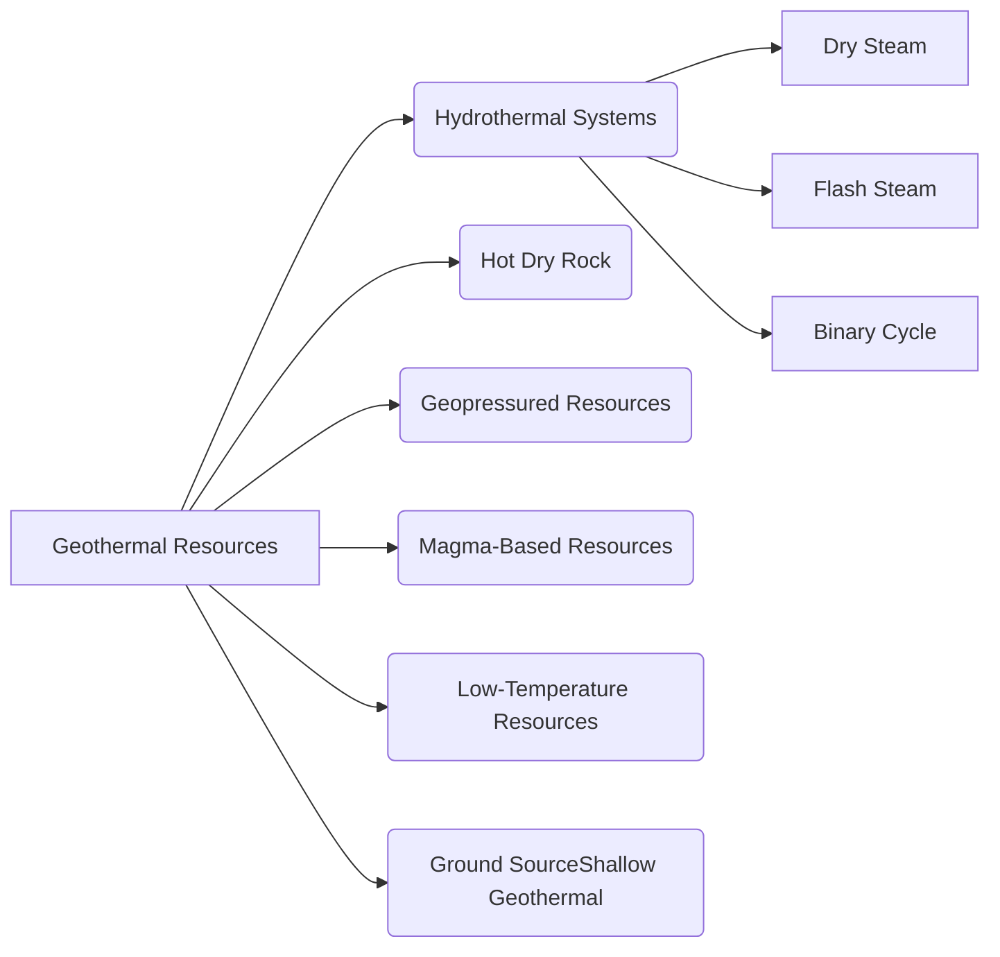
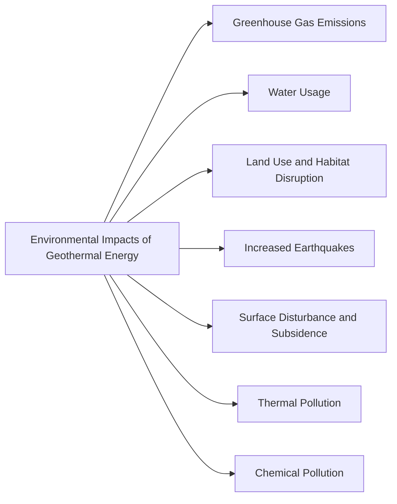

<!--
  Author: omteja04
  Created on: 07-11-2024 19:36:45
  Description: Mid-2
-->

- [List out various types of Geothermal resources. What are the environmental impacts of geothermal energy?](#list-out-various-types-of-geothermal-resources-what-are-the-environmental-impacts-of-geothermal-energy)
  - [**Types of Geothermal Resources**](#types-of-geothermal-resources)
  - [**Environmental Impacts of Geothermal Energy**](#environmental-impacts-of-geothermal-energy)
- [Explain the working of open and closed cycle OTEC plant with neat diagrams.](#explain-the-working-of-open-and-closed-cycle-otec-plant-with-neat-diagrams)
  - [1. **Open-Cycle OTEC Plant**](#1-open-cycle-otec-plant)
  - [2. **Closed-Cycle OTEC Plant**](#2-closed-cycle-otec-plant)
- [Describe the closed cycle OTEC system with its advantages over open cycle system. Explain about the prospects of OTEC in India](#describe-the-closed-cycle-otec-system-with-its-advantages-over-open-cycle-system-explain-about-the-prospects-of-otec-in-india)
  - [**Closed-Cycle OTEC System**](#closed-cycle-otec-system)
  - [**Advantages of Closed-Cycle Over Open-Cycle OTEC**](#advantages-of-closed-cycle-over-open-cycle-otec)
  - [**Prospects of OTEC in India**](#prospects-of-otec-in-india)
  - [**Challenges of OTEC in India**](#challenges-of-otec-in-india)
- [sList out various wave energy conversion devices. What are the advantages, limitations and application of of wave energy?](#slist-out-various-wave-energy-conversion-devices-what-are-the-advantages-limitations-and-application-of-of-wave-energy)
  - [**Various Wave Energy Conversion Devices**](#various-wave-energy-conversion-devices)
  - [**Advantages of Wave Energy**](#advantages-of-wave-energy)
  - [**Limitations of Wave Energy**](#limitations-of-wave-energy)
  - [**Applications of Wave Energy**](#applications-of-wave-energy)
- [What is the source of tidal energy? State the basic principle of tidal energy production and write major components of tidal power plant.](#what-is-the-source-of-tidal-energy-state-the-basic-principle-of-tidal-energy-production-and-write-major-components-of-tidal-power-plant)
  - [Source of Tidal Energy](#source-of-tidal-energy)
  - [**Basic Principle of Tidal Energy Production**](#basic-principle-of-tidal-energy-production)
  - [**Major Components of a Tidal Power Plant**](#major-components-of-a-tidal-power-plant)
- [Explain with sketches the various methods of tidal power generation. What are the limitations of each method?](#explain-with-sketches-the-various-methods-of-tidal-power-generation-what-are-the-limitations-of-each-method)
  - [Various Methods of Tidal Power Generation](#various-methods-of-tidal-power-generation)
  - [1. **Tidal Barrage (Tidal Range Power)**](#1-tidal-barrage-tidal-range-power)
    - [Working](#working)
    - [Limitations](#limitations)
  - [2. **Tidal Stream (Turbines in Tidal Currents)**](#2-tidal-stream-turbines-in-tidal-currents)
    - [Working](#working-1)
    - [Limitations](#limitations-1)
  - [3. **Dynamic Tidal Power (DTP)**](#3-dynamic-tidal-power-dtp)
    - [Working](#working-2)
    - [**Limitations**](#limitations-2)
  - [4. **Tidal Lagoon Power**](#4-tidal-lagoon-power)
    - [Working](#working-3)
  - [**Limitations of Tidal Lagoon:**](#limitations-of-tidal-lagoon)
- [Describe working principle of fuel cell with neat sketch and draw the performance characteristics of hydrogen-oxygen fuel cell?](#describe-working-principle-of-fuel-cell-with-neat-sketch-and-draw-the-performance-characteristics-of-hydrogen-oxygen-fuel-cell)
  - [**Working Principle of a Fuel Cell**](#working-principle-of-a-fuel-cell)
    - [Basic Working Principle:](#basic-working-principle)
  - [**Fuel Cell Components**](#fuel-cell-components)
  - [**Fuel Cell Diagram (Hydrogen-Oxygen Fuel Cell)**](#fuel-cell-diagram-hydrogen-oxygen-fuel-cell)
  - [**Performance Characteristics of a Hydrogen-Oxygen Fuel Cell**](#performance-characteristics-of-a-hydrogen-oxygen-fuel-cell)
  - [Hydrogen-Oxygen Fuel Cell Performance Curve](#hydrogen-oxygen-fuel-cell-performance-curve)
    - [Key Points on the Curve:](#key-points-on-the-curve)
- [Explain methods of hydrogen production with illustrations](#explain-methods-of-hydrogen-production-with-illustrations)
  - [1. **Steam Methane Reforming (SMR)**](#1-steam-methane-reforming-smr)
  - [2. **Electrolysis of Water**](#2-electrolysis-of-water)
  - [3. **Coal Gasification**](#3-coal-gasification)
  - [4. **Biomass Gasification**](#4-biomass-gasification)
  - [5. **Thermochemical Water Splitting**](#5-thermochemical-water-splitting)
  - [6. **Photoelectrochemical (PEC) Water Splitting**](#6-photoelectrochemical-pec-water-splitting)
  - [7. **Biological Hydrogen Production (Biophotolysis)**](#7-biological-hydrogen-production-biophotolysis)
  - [Conclusion](#conclusion)
- [Write the principle of operation of MHD power generation. Explain the applications of MHD generation](#write-the-principle-of-operation-of-mhd-power-generation-explain-the-applications-of-mhd-generation)
  - [**Magnetohydrodynamic (MHD) Power Generation**](#magnetohydrodynamic-mhd-power-generation)
  - [**Applications of MHD Power Generation**](#applications-of-mhd-power-generation)
  - [**Challenges and Limitations**](#challenges-and-limitations)

## List out various types of Geothermal resources. What are the environmental impacts of geothermal energy?

### **Types of Geothermal Resources**

Geothermal resources are classified based on temperature, depth, and location. Here are the main types:

- Hydrothermal Systems
- hot Dry Rock
- Geopressured resources
- Magma-Based resources
- Low-temperature geothermal resources
- Ground Source (Shallow Geothermal)

1. **Hydrothermal Systems**:

   - The most common type used for power generation and direct heating applications.
   - Consists of hot water and steam reservoirs found within Earth's crust.
   - Further divided into **dry steam**, **flash steam**, and **binary cycle** systems.

2. **Hot Dry Rock (HDR)**:

   - Found in geologically stable areas with high temperatures but low permeability.
   - Requires enhanced geothermal systems (EGS), which involve hydraulic fracturing to create fractures that allow water circulation and heat transfer.

3. **Geopressured Resources**:

   - Formed under high pressure and contain hot water, methane gas, and dissolved salts.
   - Located at greater depths and have a high temperature and pressure.

4. **Magma-Based Resources**:

   - Found in areas with volcanic activity where magma lies close to the Earth’s surface.
   - Extremely high temperatures but challenging to access and utilize with current technology.

5. **Low-Temperature Geothermal Resources**:

   - Commonly used for direct heating applications such as heating buildings, greenhouses, and fish farms.
   - Typically have temperatures below 150°C and are often accessible at shallower depths.

6. **Ground Source (Shallow Geothermal)**:
   - Uses relatively stable ground temperatures a few meters below the surface for heating and cooling.
   - Commonly applied in ground-source heat pumps for residential and commercial buildings.



### **Environmental Impacts of Geothermal Energy**

While geothermal energy is a cleaner alternative to fossil fuels, it has some environmental impacts:

1. **Greenhouse Gas Emissions**:

   - Though much lower than fossil fuels, geothermal plants release small amounts of carbon dioxide (CO₂), methane (CH₄), and hydrogen sulfide (H₂S) naturally present in the Earth's crust.

2. **Water Usage**:

   - Geothermal plants require substantial amounts of water for cooling and reinjection into reservoirs.
   - Overuse of water resources can strain local water supplies.

3. **Land Use and Habitat Disruption**:

   - Geothermal facilities require land for drilling and infrastructure, which can disturb local habitats, especially near natural reserves or protected areas.

4. **Increased Earthquakes**:

   - The process of injecting water into underground reservoirs (especially in enhanced geothermal systems) can cause minor earthquakes, known as induced seismicity.

5. **Surface Disturbance and Subsidence**:

   - The extraction of fluids from geothermal reservoirs may lead to subsidence (ground sinking), which can damage infrastructure.

6. **Thermal Pollution**:

   - The disposal of geothermal fluids can cause thermal pollution, impacting nearby ecosystems if the hot water is discharged into rivers or lakes without proper cooling.

7. **Chemical Pollution**:
   - Geothermal fluids may contain toxic chemicals, such as arsenic, boron, and mercury, which can contaminate water sources if not properly managed.



---

## Explain the working of open and closed cycle OTEC plant with neat diagrams.

Ocean Thermal Energy Conversion (OTEC) is a method of generating electricity by exploiting the temperature difference between warmer surface seawater and colder deep seawater. There are two primary types of OTEC systems: open-cycle and closed-cycle. Here’s a breakdown of how each works, along with simplified diagrams.

---

### 1. **Open-Cycle OTEC Plant**

**Working Principle:**

- An open-cycle OTEC system uses warm surface seawater directly in the turbine as the working fluid.
- The warm seawater is pumped into a low-pressure chamber, where it boils and creates steam.
- The steam generated is then used to spin a turbine connected to an electric generator, producing electricity.
- The steam is subsequently condensed back into water by exposure to cold, deep seawater.
- The condensed fresh water is then discharged back into the ocean or can be collected for freshwater supply.

**Diagram:**


**Key Points:**

- In an open-cycle plant, seawater directly serves as the working fluid.
- Produces electricity and can provide desalinated freshwater as a byproduct.
- Efficiency depends on the temperature difference between surface and deep seawater.

### 2. **Closed-Cycle OTEC Plant**

**Working Principle:**

- In a closed-cycle OTEC system, a working fluid (typically ammonia or a low-boiling-point liquid) is used instead of seawater.
- Warm surface seawater heats the working fluid in an evaporator, causing it to vaporize.
- The vaporized fluid expands and drives a turbine connected to a generator, producing electricity.
- After passing through the turbine, the vapor is condensed back into a liquid by exposure to cold deep seawater.
- The liquid working fluid is then recycled back to the evaporator to continue the cycle.

**Diagram:**


**Key Points:**

- A closed-cycle plant uses a separate working fluid with a low boiling point.
- It has a continuous cycle without the need to release water or steam to the environment.
- Higher efficiency in energy conversion compared to open-cycle systems.

> Optional
>
> ### Summary:
>
> | Aspect                 | Open-Cycle OTEC                     | Closed-Cycle OTEC                          |
> | ---------------------- | ----------------------------------- | ------------------------------------------ |
> | Working Fluid          | Warm surface seawater               | Low-boiling-point fluid (e.g., ammonia)    |
> | Byproduct              | Freshwater (from condensed steam)   | No freshwater produced                     |
> | System Complexity      | Relatively simpler                  | More complex due to working fluid handling |
> | Environmental Impact   | Minimal; produces desalinated water | Minimal; no water discharge or intake      |
> | Energy Conversion Rate | Lower                               | Higher due to efficient heat exchange      |

Both systems demonstrate the potential to utilize renewable ocean energy, and their feasibility largely depends on local temperature gradients and economic considerations.

---

## Describe the closed cycle OTEC system with its advantages over open cycle system. Explain about the prospects of OTEC in India

### **Closed-Cycle OTEC System**

In a closed-cycle Ocean Thermal Energy Conversion (OTEC) system, a secondary working fluid (typically a low-boiling-point fluid such as ammonia or propane) is used to generate electricity. The system operates on a continuous cycle in which the working fluid is evaporated, expanded to produce power, condensed, and recirculated.

**Working Principle:**

- In a closed-cycle OTEC system, a working fluid (typically ammonia or a low-boiling-point liquid) is used instead of seawater.
- Warm surface seawater heats the working fluid in an evaporator, causing it to vaporize.
- The vaporized fluid expands and drives a turbine connected to a generator, producing electricity.
- After passing through the turbine, the vapor is condensed back into a liquid by exposure to cold deep seawater.
- The liquid working fluid is then recycled back to the evaporator to continue the cycle.


### **Advantages of Closed-Cycle Over Open-Cycle OTEC**

- **Higher Efficiency**: Uses low-boiling-point fluid, optimizing energy conversion.
- **Environmentally Controlled**: The working fluid is contained, avoiding water discharge.
- **Less Complexity**: Avoids direct seawater use, simplifying operation.
- **Reduced Maintenance**: Compact heat exchangers require less maintenance than large low-pressure chambers in open-cycle systems.

### **Prospects of OTEC in India**

- **Ideal Ocean Conditions**: India’s tropical waters, especially near Tamil Nadu and Lakshadweep, offer the temperature gradient needed for OTEC.
- **Continuous Power Supply**: OTEC can provide baseload power for coastal and island regions.
- **Freshwater Production**: Open-cycle OTEC can offer desalinated water as a byproduct, valuable for regions facing freshwater scarcity.
- **Research Initiatives**: Institutions like NIOT (Chennai) are exploring OTEC for energy and desalination, supported by government initiatives and international partnerships.

### **Challenges of OTEC in India**

- **High Initial Costs**: Significant investment is needed, especially for deep-sea infrastructure.
- **Technical Demands**: The technology for large-scale OTEC plants is still under development.
- **Environmental Concerns**: Large-scale water intake and discharge may impact marine ecosystems.

---

## sList out various wave energy conversion devices. What are the advantages, limitations and application of of wave energy?

### **Various Wave Energy Conversion Devices**

Wave energy conversion devices are designed to capture the energy from ocean waves and convert it into useful forms like electricity. Below are some common types of wave energy converters:

1. **Point Absorbers**: These are floating structures that move with the motion of the waves. They capture energy from the vertical motion of the waves. Example: **Oyster**.

2. **Oscillating Water Columns (OWC)**: These structures use the rise and fall of the water level inside a chamber to drive air through a turbine, which generates electricity. Example: **Limpet**.

3. **Attenuators**: These are long, multi-segmented floating structures that move with the waves along the wave direction. The relative motion between segments captures energy. Example: **Pelamis**.

4. **Overtopping Devices**: These devices allow water to flow over a ramp and into a reservoir, where the water is then released back to the ocean, driving turbines to generate power. Example: **Wave Dragon**.

5. **Submerged Pressure Differential Devices**: These devices are placed below the water’s surface and capture energy from the pressure differential caused by wave motion. Example: **Seawave Slot-Cone Generator**.

6. **Vortex-Induced Vibration Devices**: These devices capture energy from the vortices created by water flowing around a cylindrical structure. Example: **VIVACE**.

### **Advantages of Wave Energy**

1. **Renewable and Clean**: Wave energy is a renewable resource that produces no direct emissions during operation, making it an environmentally friendly energy source.

2. **Predictability**: Unlike solar or wind, ocean waves are relatively predictable and consistent, providing more reliable energy generation.

3. **High Energy Density**: Wave energy is denser than wind energy, which allows smaller devices to generate a considerable amount of power.

4. **Minimal Land Use**: Since wave energy is harnessed from the ocean, it doesn't require land-based infrastructure or significant land use, making it less disruptive to terrestrial ecosystems.

5. **Potential for Coastal Areas**: Wave energy can be a valuable energy source for coastal areas that lack access to other forms of renewable energy, providing an opportunity for local energy independence.

### **Limitations of Wave Energy**

1. **High Initial Costs**: The installation and infrastructure costs for wave energy devices are high, especially for offshore devices.

2. **Environmental Impact**: While clean, wave energy devices can have localized impacts on marine ecosystems, including disruptions to fish migration and habitats.

3. **Maintenance Challenges**: Offshore installations are difficult and expensive to maintain due to their exposure to harsh marine conditions.

4. **Energy Storage**: Wave energy generation is intermittent, and storage solutions (such as batteries) are needed to ensure a continuous power supply.

5. **Transmission Losses**: Transmitting energy from offshore wave devices to land can involve long distances, leading to energy loss and the need for robust transmission infrastructure.

6. **Limited Locations**: Wave energy can only be harnessed in coastal regions with sufficient wave activity, limiting its applicability in many areas.

### **Applications of Wave Energy**

1. **Electricity Generation**: Wave energy can be used to generate electricity for coastal communities or even to feed into the grid.

2. **Desalination**: Wave energy could power desalination plants, providing fresh water to coastal and island communities with limited freshwater resources.

3. **Pumping and Water Supply**: Wave energy can be used to pump water, especially in remote coastal areas, reducing the need for external power sources.

4. **Offshore Applications**: In addition to power generation, wave energy could be used for other offshore applications such as aquaculture and offshore oil and gas operations.

5. **Integration with Other Renewables**: Wave energy can be integrated with other renewable energy systems, such as wind or solar, to provide a more reliable and consistent energy supply.

---

## What is the source of tidal energy? State the basic principle of tidal energy production and write major components of tidal power plant.

### Source of Tidal Energy

Tidal energy is generated from the gravitational interaction between the Earth, the Moon, and the Sun, which causes the periodic rise and fall of ocean water levels. These tidal movements create a flow of water that can be harnessed for power generation. The primary source of tidal energy is the **tide**, which is influenced by:

- **Gravitational pull of the Moon**: The Moon's gravity causes a bulge of water on the side of Earth facing the Moon.
- **Gravitational pull of the Sun**: The Sun also exerts a gravitational force on Earth's oceans, but to a lesser extent than the Moon.
- **Earth's rotation**: The Earth's rotation causes the tides to shift in predictable patterns.

Tidal energy is harnessed through this **regular ebb** and **flow of water** in the ocean, which can be used to generate electricity.

> _Ebb_ refers to the falling or receding of the tide. It is the period when the water level decreases after reaching its highest point (high tide) and moves back toward the sea. During the ebb tide, water flows out of a bay, estuary, or coastal area.

### **Basic Principle of Tidal Energy Production**

Tidal energy production is based on the principle of harnessing the movement of tidal water to drive turbines or other mechanical systems for power generation. The basic processes are:

1. **Tidal Rise and Fall**: The rise and fall of sea levels (the tide) create potential energy as water is either accumulated in a reservoir or as it moves in and out of a tidal area.
2. **Kinetic Energy**: When the tide flows in (flood tide) or out (ebb tide), it moves large volumes of water. The movement (kinetic energy) of water can be captured through turbines or other mechanical systems.

3. **Energy Conversion**: The motion of the water drives turbines, and the mechanical energy is converted into electrical energy via generators.

There are two main types of tidal power systems:

- **Tidal Stream**: Uses the kinetic energy of moving water to turn turbines, similar to underwater wind turbines.
- **Tidal Range**: Uses the potential energy from the difference in height between high and low tides to generate electricity.

### **Major Components of a Tidal Power Plant**


1. **Tidal Barrage**: A large dam-like structure built across the entrance to a tidal basin. It has sluice gates, turbines, and a powerhouse. When the tide rises, water is trapped in the basin, and when the tide falls, the stored water is released through turbines to generate electricity.

2. **Turbines**: The turbines are the key components that convert the kinetic energy of moving water into mechanical energy. In tidal stream systems, turbines are placed directly in the path of the water flow.

3. **Sluice Gates**: These gates control the flow of water in and out of the tidal basin. They allow water to be trapped during high tide and released through turbines during low tide.

4. **Powerhouse**: The powerhouse houses the generators that convert mechanical energy from the turbines into electrical energy. It is typically located behind the barrage or tidal dam.

5. **Substation**: The substation is used to step up the voltage for transmission to the grid.

6. **Cabling and Transmission Lines**: These carry the electricity generated at the power plant to the electrical grid for distribution.

> Optional
>
> ### **Types of Tidal Power Systems**
>
> 1.  **Tidal Range Power Plants (Barrages)**: These systems take advantage of the difference in water levels between high and low tides to create potential energy. The water is stored during high tide and released to generate power during low tide.
>
> 2.  **Tidal Stream Power Plants**: These use underwater turbines to capture the kinetic energy of moving water. They are similar to underwater wind turbines, harnessing energy from tidal currents rather than the height difference.
>
> 3.  **Dynamic Tidal Power**: A more experimental form, which aims to capture both the potential and kinetic energy from the tidal differences along coastal areas, with a large dam-like structure extending out into the ocean.

---

## Explain with sketches the various methods of tidal power generation. What are the limitations of each method?

### Various Methods of Tidal Power Generation

Tidal power generation utilizes the rise and fall of tides (ebb and flood) to generate electricity. There are four primary methods for harnessing tidal energy:

1. **Tidal Barrage (Tidal Range Energy)**
2. **Tidal Stream (Turbines in Tidal Currents)**
3. **Dynamic Tidal Power (DTP)**
4. **Tidal Lagoon Power**

### 1. **Tidal Barrage (Tidal Range Power)**

A **tidal barrage** is a dam-like structure built across the entrance of an estuary, bay, or tidal basin. It captures the potential energy created by the difference in water level between high tide and low tide.

#### Working

- During **high tide**, water is allowed to flow into the tidal basin through sluice gates.
- When the tide falls (during **ebb tide**), the sluice gates are closed, and the water is trapped.
- As the tide continues to drop, the water level inside the basin is higher than the outside (ocean), creating a pressure difference.
- The stored water is released through turbines, generating electricity as it flows back into the sea.

**Diagram:**


#### Limitations

- **Environmental Impact**: Large-scale barrages can disrupt local ecosystems, particularly fish migration and coastal habitats.
- **High Initial Costs**: Building a large structure across a bay or estuary is capital intensive.
- **Limited Locations**: Suitable only where there's a significant tidal range, which limits the number of viable locations.
- **Maintenance**: The constant exposure to harsh marine environments can lead to high maintenance costs.

---

### 2. **Tidal Stream (Turbines in Tidal Currents)**

**Tidal stream energy** harnesses the kinetic energy of moving water in tidal currents (similar to underwater wind turbines). These turbines are placed in areas with strong tidal currents, typically on the seabed, to generate electricity.

#### Working

- The **turbines** are placed underwater in locations with strong tidal currents (ebb and flood).
- As water moves through the turbines, it spins the blades, generating mechanical energy.
- The mechanical energy is converted into electricity via a generator.

**Diagram:**


#### Limitations

- **Intermittency**: Tidal currents are not continuous, so power generation is not constant.
- **Installation and Maintenance**: Installing turbines underwater and maintaining them in harsh marine conditions can be expensive and challenging.
- **Effect on Marine Life**: The turbines could pose a risk to marine organisms, especially fish, if not properly designed.
- **Energy Transmission**: Transmitting the generated power from offshore locations to land can result in transmission losses.

---

### 3. **Dynamic Tidal Power (DTP)**

Dynamic Tidal Power (DTP) is a relatively new concept that aims to harness both the potential and kinetic energy of the tides. It involves constructing a large structure that extends into the ocean, perpendicular to the coastline, to capture tidal energy without enclosing a specific tidal basin.

#### Working

- A long dam-like structure is built perpendicular to the coastline, extending into deep water.
- The flow of water on either side of the structure creates differences in water pressure (both kinetic and potential).
- The structure captures this energy through turbines embedded along its length, converting it into electricity.

**Diagram:**

```
         [Sea] --> [DTP Structure] --> [Turbines] --> [Generator]
                            (Perpendicular to Coast)       |
                                                           |
                                                      Electricity
```

#### **Limitations**

- **Experimental Technology**: Still in the experimental stage and not yet commercially viable.
- **High Initial Investment**: The infrastructure required for a large-scale DTP system is costly.
- **Environmental Impact**: It could disrupt local marine ecosystems if not properly managed.
- **Limited Locations**: Requires specific ocean conditions to be effective.

### 4. **Tidal Lagoon Power**

**Tidal lagoon power** is a method of generating electricity by creating an artificial lagoon in a coastal area, surrounded by a breakwater. The lagoon captures the potential energy of the tides, similar to a tidal barrage but with less environmental impact, as it does not require a large dam structure across an estuary or bay.

#### Working

- A **lagoon** is formed by constructing a breakwater or seawall along the coast, with an opening for water to flow in and out.
- As the tide rises, water enters the lagoon and is trapped.
- When the tide falls, the water in the lagoon is released through turbines that generate electricity as the water flows back into the sea.
- Similar to tidal barrage, the system works by exploiting the **difference in water levels** between high and low tide.

**Diagram:**

```
      [Sea] --> [Tidal Lagoon] --> [Turbines] --> [Generator] --> [Power Substation]
                  (Artificial Coastal Lagoon)        |

                                                  Electricity
```

### **Limitations of Tidal Lagoon:**

- **High Capital Cost**: Constructing a tidal lagoon requires significant investment in infrastructure, including breakwaters and turbines.
- **Environmental Impact**: While less invasive than a tidal barrage, building a lagoon can still affect local marine ecosystems, especially in terms of water flow and wildlife.
- **Limited Locations**: Suitable locations are dependent on coastal geography and tidal range, limiting the number of possible sites.
- **Energy Output Variability**: Like other tidal methods, power generation is intermittent, and depends on the tides.
- **Regulatory and Planning Challenges**: Large-scale tidal lagoon projects may face regulatory hurdles, including environmental assessments and public opposition.

> Optional
>
> ### Summary of All Methods
>
> 1.  **Tidal Barrage (Tidal Range)**:
>
> - **Advantages**: Proven technology, high energy output, predictable power generation.
> - **Limitations**: High environmental impact, high initial cost, limited locations.
>
> 2.  **Tidal Stream (Turbines in Tidal Currents)**:
>
> - **Advantages**: Minimal environmental disruption, lower construction costs, scalable.
> - **Limitations**: Intermittent energy, installation and maintenance challenges, impact on marine life.
>
> 3.  **Dynamic Tidal Power (DTP)**:
>
> - **Advantages**: Can capture both potential and kinetic energy, large energy generation potential.
> - **Limitations**: Still experimental, high infrastructure costs, environmental impact.
>
> 4.  **Tidal Lagoon**:
>
> - **Advantages**: Lower environmental impact compared to tidal barrage, flexible power generation.
> - **Limitations**: High capital costs, location-specific, environmental concerns, intermittent power generation.

---

## Describe working principle of fuel cell with neat sketch and draw the performance characteristics of hydrogen-oxygen fuel cell?

### **Working Principle of a Fuel Cell**

A **fuel cell** is an electrochemical device that converts the chemical energy of a fuel (usually hydrogen) and an oxidizing agent (usually oxygen) into electrical energy, water, and heat, through an electrochemical reaction.

#### Basic Working Principle:

1. **Electrochemical Reaction**: In a fuel cell, hydrogen gas (H₂) is fed to the **anode**, and oxygen gas (O₂) is fed to the **cathode**.
2. **Anode Reaction**: At the anode, hydrogen molecules are split into protons (H⁺) and electrons (e⁻) through the action of a catalyst (usually platinum).
   \[
   H_2 \rightarrow 2H^+ + 2e^-
   \]
3. **Electron Flow**: The electrons are forced to travel through an external circuit, generating an electric current (electrical energy).
4. **Proton Flow**: The protons (H⁺) pass through the **electrolyte** (a proton-conductive material, often an acidic membrane) to reach the cathode.
5. **Cathode Reaction**: At the cathode, the oxygen (O₂) combines with the electrons (which have traveled through the external circuit) and protons (which have traveled through the electrolyte) to form water (H₂O).
   \[
   \frac{1}{2}O_2 + 2H^+ + 2e^- \rightarrow H_2O
   \]
6. **Overall Reaction**: The overall reaction in the fuel cell is the combination of hydrogen and oxygen to form water and release electrical energy:
   \[
   H_2 + \frac{1}{2}O_2 \rightarrow H_2O + \text{Electrical Energy}
   \]

### **Fuel Cell Components**

1. **Anode**: The electrode where hydrogen gas is oxidized into protons and electrons.
2. **Cathode**: The electrode where oxygen is reduced and combines with protons and electrons to form water.
3. **Electrolyte**: A substance that allows only protons (H⁺) to pass through from the anode to the cathode, maintaining the ion flow.
4. **External Circuit**: The path through which the electrons flow from the anode to the cathode, generating electricity.

### **Fuel Cell Diagram (Hydrogen-Oxygen Fuel Cell)**


### **Performance Characteristics of a Hydrogen-Oxygen Fuel Cell**

The **performance characteristics** of a hydrogen-oxygen fuel cell can be represented as a **Voltage-Current** curve, which shows how the output voltage changes with the current drawn from the fuel cell.

### Hydrogen-Oxygen Fuel Cell Performance Curve

A typical **Voltage vs. Current** curve for a hydrogen-oxygen fuel cell might look like this:


> Graph Using Matplotlib 🙂

#### Key Points on the Curve:

- **Open-Circuit Voltage (OCV)**: This is the voltage when the current is zero, typically around 1.0-1.2 V.
- **Peak Power Point**: The point where the fuel cell delivers maximum power occurs at a specific current and voltage.
- **Low Voltage at High Current**: At high currents, the voltage significantly drops due to various losses within the fuel cell.

> ### Limitations of Hydrogen-Oxygen Fuel Cells:
>
> 1.  **Cost**: The high cost of materials (e.g., platinum catalysts) makes fuel cells expensive to produce.
> 2.  **Durability**: Fuel cells have limited lifespan due to catalyst degradation and membrane wear over time.
> 3.  **Storage and Distribution of Hydrogen**: Storing and transporting hydrogen is challenging and requires high-pressure storage systems or cryogenic storage.
>
> 4.  **Hydrogen Production**: Currently, most hydrogen is produced from fossil fuels (via steam methane reforming), which can negate some of the environmental benefits of using fuel cells.
> 5.  **Efficiency Losses**: Fuel cells can suffer from efficiency losses at high current densities, leading to less energy output.

---

## Explain methods of hydrogen production with illustrations

Hydrogen can be produced through various methods, and each has its own set of advantages and challenges. Below are the main methods of hydrogen production, along with simple illustrations to help visualize the processes:

### 1. **Steam Methane Reforming (SMR)**

**Process:**

- **Steam Methane Reforming (SMR)** is the most widely used method to produce hydrogen. It involves reacting methane (natural gas) with steam over a catalyst to produce hydrogen and carbon monoxide (CO).

  \[
  \text{CH}\_4 + \text{H}\_2\text{O} \rightarrow \text{CO} + 3\text{H}\_2
  \]

- This process is carbon-intensive since it generates CO₂ as a byproduct.

**Illustration:**


### 2. **Electrolysis of Water**

**Process:**

- **Electrolysis** involves using electricity to split water (H₂O) into hydrogen (H₂) and oxygen (O₂). This process can be performed with renewable energy sources like solar or wind power, making it a clean and sustainable option.

  \[
  2H_2O \rightarrow 2H_2 + O_2
  \]

**Illustration:**


### 3. **Coal Gasification**

**Process:**

- **Coal Gasification** is the process of converting coal into synthetic gas (syngas) by reacting it with oxygen and steam at high temperatures. The syngas contains hydrogen, which can be separated.

  \[
  \text{C} + \text{H}\_2\text{O} \rightarrow \text{CO} + \text{H}\_2
  \]

- It is a carbon-heavy process because coal combustion results in significant CO₂ emissions.

**Illustration:**

```
   Coal + Steam + Oxygen
           |
     High Pressure + Heat
           |
        Syngas (CO + H2)
           |
       Hydrogen Extraction
           |
         Hydrogen (H2)
```

### 4. **Biomass Gasification**

**Process:**

- **Biomass Gasification** involves converting organic materials (like wood, agricultural residues, or waste) into hydrogen and other gases by heating them with oxygen or steam.

  \[
  \text{Biomass} + \text{Steam/Oxygen} \rightarrow \text{Syngas (H}\_2\text{, CO, CO}\_2\text{)}
  \]

**Illustration:**

```
   Biomass + Steam/Oxygen
            |
      High Temperature
            |
         Syngas
            |
     Hydrogen Extraction
            |
        Hydrogen (H2)
```

### 5. **Thermochemical Water Splitting**

**Process:**

- **Thermochemical Water Splitting** uses high temperatures (usually from concentrated solar power) to split water into hydrogen and oxygen. It involves chemical reactions that are driven by heat rather than electricity.

**Illustration:**

```
   High Temperature Source
        (Concentrated Solar Power)
             |
        Water (H2O)
             |
     Thermochemical Reaction
             |
      Hydrogen (H2) + Oxygen (O2)
```

### 6. **Photoelectrochemical (PEC) Water Splitting**

**Process:**

- **PEC Water Splitting** combines solar energy with electrolysis. Photoelectrochemical cells use sunlight to drive the splitting of water directly into hydrogen and oxygen.

**Illustration:**

```
      Sunlight
         |
  Photoelectrochemical Cell
         |
     Water (H2O)
         |
  Splitting into H2 + O2
         |
     Hydrogen (H2) + Oxygen (O2)
```

### 7. **Biological Hydrogen Production (Biophotolysis)**

**Process:**

- Some microorganisms (like algae and certain bacteria) can produce hydrogen through biological processes such as biophotolysis, where light energy is used to split water molecules.

**Illustration:**

```
   Light Energy
         |
  Microorganism (Algae/Bacteria)
         |
      Biophotolysis
         |
     Hydrogen (H2) + Oxygen (O2)
```

### Conclusion

Each hydrogen production method varies in efficiency, cost, and environmental impact. Renewable methods like **electrolysis** and **biological production** are gaining attention for their low carbon footprint, while **SMR** and **coal gasification** are more commonly used but have a higher environmental impact.

---

## Write the principle of operation of MHD power generation. Explain the applications of MHD generation

### **Magnetohydrodynamic (MHD) Power Generation**

**Principle of Operation**

Magnetohydrodynamic (MHD) power generation works by using a conductive fluid, usually plasma, which is heated and ionized from a fuel source. When this plasma moves through a magnetic field, an electric current is induced due to the interaction between the magnetic field and the charged particles in the plasma, according to **Faraday's Law of Induction**.

1. **Plasma Formation**: A fuel is burned to generate high-temperature gases, which are ionized to form plasma.
2. **Magnetic Field**: A strong magnetic field is applied perpendicular to the plasma flow.
3. **Current Induction**: The movement of plasma through the magnetic field induces an electric current.
4. **Power Extraction**: Electrodes collect the generated current, which is then extracted and converted into electrical power.

This system eliminates mechanical parts, making it more efficient by directly converting thermal energy to electrical energy.


### **Applications of MHD Power Generation**

1. **Spacecraft Power**: MHD generators are ideal for use in spacecraft because they don’t rely on mechanical parts, making them suitable for zero-gravity conditions.
2. **Hybrid Power Systems**: MHD can be integrated with fossil fuel power plants, improving efficiency by directly converting thermal energy into electricity.
3. **Nuclear Power**: MHD technology can be used in nuclear reactors, utilizing the high temperatures to ionize gases and produce power more efficiently.
4. **High-Efficiency Generation**: With no moving parts like turbines, MHD systems reduce mechanical losses, providing higher efficiency.
5. **Electromagnetic Pumps**: MHD is used for pumping conductive liquids, like molten metals, in systems such as nuclear reactors.
6. **Fusion Research**: MHD plays a key role in understanding plasma behavior in fusion reactors.
7. **Defense Applications**: MHD can be used in high-speed propulsion systems for military applications.

### **Challenges and Limitations**

Despite its advantages, MHD technology faces challenges such as:

- **High Costs**: The materials needed to handle high temperatures and strong magnetic fields in MHD systems are expensive.
- **Magnetic Field Requirements**: Producing and maintaining strong magnetic fields is challenging and costly.
- **Plasma Stability**: Maintaining stable plasma conditions for efficient energy conversion is difficult and requires sophisticated control mechanisms.

---

<br>
<div align='center'>
  <a href='https://github.com/omteja04' target='_blank'>
    
  </a>
</div>
